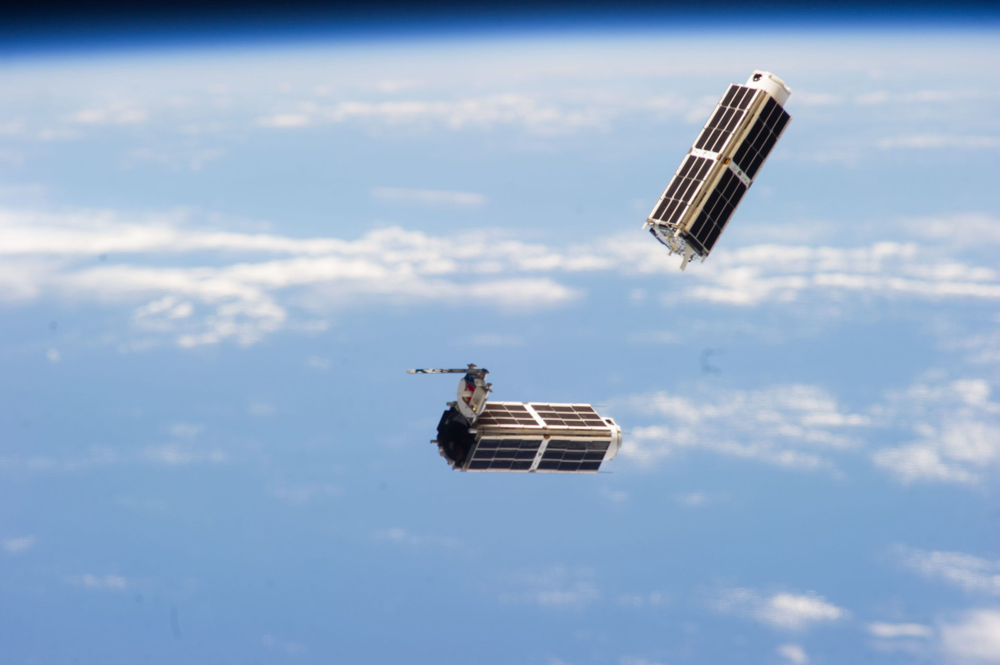

# Planet Python Module



### What is this repository for? ###

* Quick summary
* Quick set up
* A Python module to search and download [Planet Labs Imagery](https://www.planet.com)

### How do I get set up? ###

The environment file (i.e. planet_python.yml) lists all the packages needed to run the module. If a package has a dependency not listed, conda finds a compatible package version for you.

* Create a conda environment, type:
```
conda env create --file = planet_python.yaml
```
* Once the environment has been created, type:
```
conda activate planet_python
```
* Later, when finished using the environment, type
```
conda deactivate planet_python
```
* To return to the base environment, and to fully remove the environment from your Anaconda installation.
```
conda remove -n planet_python --all
```
### How do I use the planet_python.py? ###

Below a quick demo on how to use the module. 

```python
# import libraries 
from planet_python import *
from planet_python import get_feature_coord
from planet_python import get_point_square
import pandas as pd
import geojson
```
To search and clip images for a specific AOI, you can create an AOI or you can read the geometry of your AOI from a geojson file. The function get_point_square allows you to create a square by giving the point's lat and Long (the point is located at the center of the square). Here is an example:

```python
geojson = get_point_square(lat = 40.774541, lon = -96.634086, size = 0.05)
```
```python
print(geojson)

{'type': 'Polygon',
 'coordinates': [[[-96.634086, 40.774541],
   [-96.584086, 40.774541],
   [-96.584086, 40.724541],
   [-96.634086, 40.724541],
   [-96.634086, 40.774541]]]}
```
Or you can read the AOI geometry from a geojson file. Here is an example for a shapefile with multiple features:
```python
geojson = get_feature_coord(geojson_file, feature_index = 3) # select the fourth element in the attribute table
```
```python
print(geojson)

{'type': 'Polygon',
    'coordinates': [[[682079.523545, 3963563.72741],
    [682080.989577, 3963570.813836],
    [682088.556676, 3963576.634681],
    ...         ...           ...
    [682079.523545, 3963563.72741]]]}
```
### How do I search for images? ###
You can use planet_search function.

```python
# define arguments
planet_key = 'f4514fce28094f3b99egd399c9b01b' # not valid!
item_type = "REOrthoTile"
st = "2008-01-01T16:00:00.000Z"
ed = "2020-06-20T23:59:59.999Z"
cc = 0.8
save = 'output/' # if folder does not exist the function will create it

# execute function, the output is a csv!
planet_search(planet_key = planet_key,
        item_type = item_type,
        st = st, ed = ed,
        geojson = get_point_square(40.774541,-96.634086, size = 0.05),
        save_dir = save,
        search_name= 'tst',
        cc = cc)
```

### How do I download a bunch of clipped images? ###
You can use planet_download_clip function.

```python
# define arguments
planet_key = 'f4514fce28094f3b99eff9sd99b01b' # not valid!
item_type = "REOrthoTile"
st = "2008-01-01T16:00:00.000Z"
ed = "2020-06-20T23:59:59.999Z"
cc = 0.8
save = 'output/' # if folder does not exist the function will create it

# get images id from the csv output from planet_search
imgs = pd.read_csv('REOrthoTile_tst.csv')['id'].to_list()

planet_download_clip(
        planet_key = planet_key,
        geojson = get_point_square(40.774541,-96.634086, size = 0.05),
        feature_name = 'holmes_lake_NE',
        items_id = imgs, # needs to be a list!
        item_type = item_type,
        save_dir = save)
```

### Who do I talk to when finding a problem? ###

* Vini Perin (vperin@ncsu.edu)